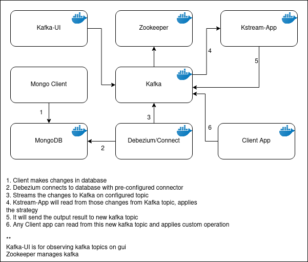

# CDC using Debezium
This project uses debezium connector to mongof=db for getting change data capture and sends it to kafka stream.
## Description
This project has multiple docker containers running for different purpose.
* zookeeper([debezium/zookeeper](https://hub.docker.com/r/debezium/zookeeper))
*  kafka([debezium/kafka](https://hub.docker.com/r/debezium/kafka)) for messeging
* kafka-ui([kafka-ui](https://hub.docker.com/r/provectuslabs/kafka-ui)) for viewing the kafka stream
* mongodb([debezium/example-mongodb](https://hub.docker.com/r/debezium/example-mongodb)) as source database

## Structure

## Getting Started
### Dependencies
* Host machines needs to have docker installed and running
* For building project locally java and maven is required
### Installing
* Clone the repository in local directory
### Executing 
 There are multiple steps to run start the project
* Start docker containers
```
export DEBEZIUM_VERSION=1.4
docker-compose -f docker-compose-mongodb.yaml up
```
 * If you are using windows
 ```
set DEBEZIUM_VERSION=1.4
 ```
*  Initialize MongoDB replica set and insert some test data
```
docker-compose -f docker-compose-mongodb.yaml exec mongodb bash -c '/usr/local/bin/init-inventory.sh'
```
*  Start MongoDB connector
```
curl -i -X POST -H "Accept:application/json" -H  "Content-Type:application/json" http://localhost:8083/connectors/ -d @register-mongodb.json
```
*  Create outgoing topic for processed data
```
docker-compose -f docker-compose-mongodb.yaml run kafka create-topic product
```
 Open kafka-ui on [localhost:8000](localhost:8000) for viewing the streaming messages

*  Create image of maven project named kstream
```
docker build -t kstream .
```
* Run the image for seeing results
```
docker run --network cdc-debezium_cdc --link kafka:kafka kstream
```
### Help
#### There are some parameters need to considered running this project
* By default it will take the input topic for kafka stream as **dbserver1.inventory.customers** and output topic as **product**,  you can change it in MongoCDCKStream.java before starting the project.
* Default kafka host is taken as kafka container running in same docker network
* If you want run in different container make sure to add `--network cdc-debezium_cdc --link kafka:kafka` for getting the connection to kafka
* There are 3 manners you get output stream in product, you set the stratergy in `MongoCDCKStream.java
    * **PATCH**
    * **BEFORE_AFTER** (default)
    * **DELTA**
* You can set them as per your requirement.
* You can use MongoDB Compass to update the data in database, changes will be sent in topic named `product` according to stratergy set earlier.
* You can subscribe to topic `product` kafka stream from any project as a client and do your thing.
### More
* Source maven project is from [ gh-mlfowler/mongo-cdc-demo](https://github.com/gh-mlfowler/mongo-cdc-demo) which runs on vagrant rather than docker, you can check it out for more information. 
## Version History
* Initial Release 0.0
